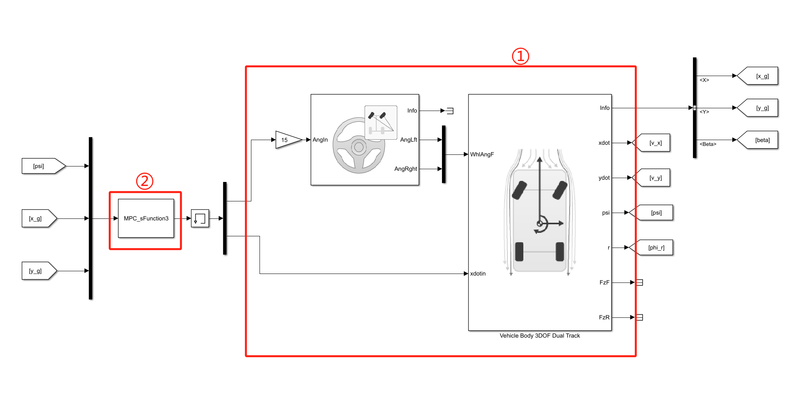
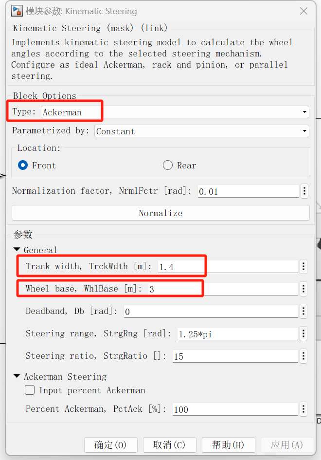
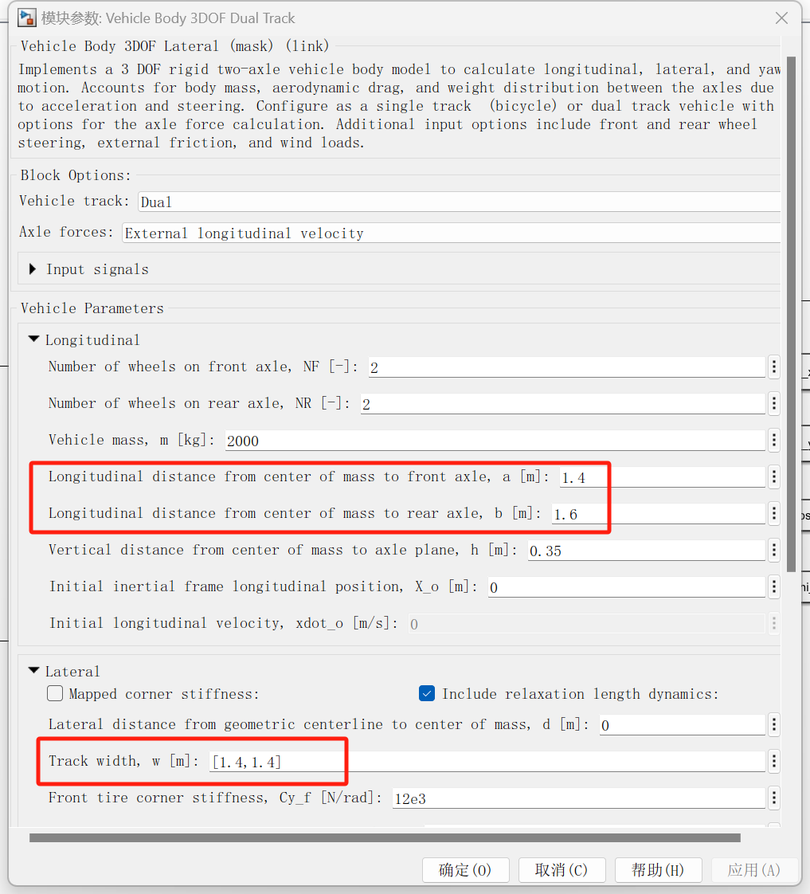
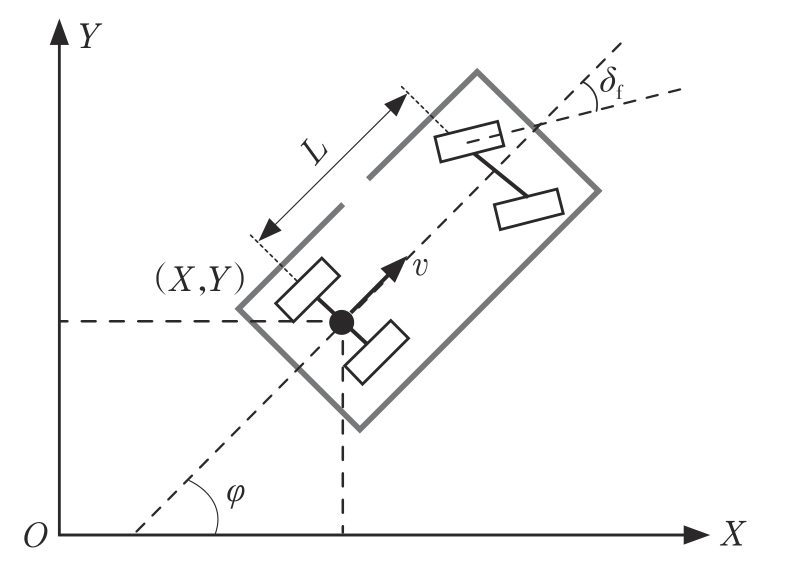
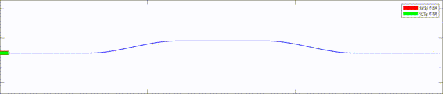

# 1 轨迹跟踪控制算法介绍

本项目轨迹跟踪算法采用经典的MPC控制，本案例主要解决横向轨迹跟踪制问题，纵向以速度形式直接输出。

- **问题边界**
  
  - 轨迹跟踪问题接收上游规划决策的轨迹或路径数据，通常为带时间戳的坐标点。
  - 输出为车辆方向盘/前轮转角和油门开度。

- **轨迹跟踪控制问题概述**
  
  - 控制问题按找执行输出的不同可以分为横向控制、纵向控制及组合控制。
  - **横向控制** 车辆完成路径跟踪任务，能实现车辆的换道，输出为方向盘转角或前轮转角。
  - **纵向控制** 车辆完成时域跟踪任务，能实现车辆的加速和减速，输出为油门开度。
  - **组合控制** 同时考虑车辆和横向和纵向控制的时空耦合关系，同时输出转向和驱动的执行目标

- **MPC控制算法概述**
  
  - 模型预测控制(MPC, Model Predictive Control)是经典且常见的控制算法，在控制领域应用广泛。
  - MPC通过对被控对象建模，从而能利用控制量预测得到输出结果。通过以控制量为变量，构造控制量和控制误差的目标函数，从而转化成优化问题，进而求解出控制序列。
  - 通常求解得到的控制序列只取第一个时刻的值作为本轮优化迭代的结果进行输出，下一个时刻滚动优化，从而避免误差累积提高系统应对动态变化的能力。
  - MPC控制需要解决的两个核心的问题分别是**建模**和**优化**。对于优化问题通常是转换成标准问题利用现有的工具箱进行求解；而建模问题则需要具体问题进行分析。

# 2 本地运行

## 2.1 软件准备

本项目可运行在MATLAB R2022a及以上版本，需安装完整的Simulink工具箱。

## 2.2 文件说明

- `reference.mat`为参考轨迹数据，包含时间戳`t_ref`,x坐标`x_ref`,y坐标`y_ref`三个变量。参考轨迹通常由上游决策规划模块生成。

- `Sim_Demo.slx`为Simulink文件，用于图形化编程及仿真运行。主要包括整体控制框架和被控对象模型等。

- `MPC_sFunction.m`控制器s函数文件，MPC控制算法代码编写在该文件中。

- `evaluator.mlx`后处理部分代码在该文件中，包括轨迹、误差、车辆状态参数曲线的绘制，动画演示。

## 2.3 操作步骤

### 2.3.1 准备

- 下载项目并解压，将MATLAB的工作路径设置为该文件夹；
  
    

- 或将文件夹中的文件复制到当前文件夹下。

### 2.3.2 运行文件

- 双击`Sim_Demo.slx`文件，并等待启动Simulink。

- 点击`运行`按钮开始仿真。
  
  

- 运行结束后，后在工作目录下会生成`reference_processed.mat`和 `Sim_result.mat`两个数据文件。`reference_processed.mat`为仿真时控制器为减少重复计算，初始化计算产生的中间数据。
  `Sim_result.mat`为仿真结果数据。

### 2.3.3 后处理运行结果

- 仿真结束后，需要对结果进行可视化绘图。双击 `evaluator.mlx`。

- 在`实时编辑器`选项卡下，按顺序点击`运行节`，查看每一节的运行结果。
  
  

# 3 代码解析说明

## 3.1 仿真模型

- 仿真模型主体包括两部分：①被控对象和②控制器。
  
  

- **被控对象**利用的是Simulink工具箱中的`Vechicle Dynamic Blockset`中的运动学转向系统模型和双轨车身三自由度模型。因为本项目主要关注横向控制，车身三自由度模型中，纵向的车速为直接输入。运动学转向系统模型类型选择为阿克曼转向关系`Ackerman`,参数设置中轮距`Track width, TrckWdth`和轴距`Wheel base, WhlBase`需要和整车模型中的一致，从而保证转向系统和整车匹配。其中轴距为质心到前后轴距离之和：$WhlBase=a+b$
  
    
  
    

- **控制器**用s-函数编写，输入车辆当前横摆角和大地坐标系下的xy坐标，具体代码及参数详见后文。

## 3.2 MPC控制器

MPC控制器写成s-函数的形式

### 3.2.1 s-function主函数

```MATLAB
function [sys,x0,str,ts]=MPC_sFunction3(t,x,u,flag)
switch flag
    case 0
        [sys,x0,str,ts]=mdlInitializeSizes;
    case 1
        sys=mdlDerivatives(t,x,u);
    case 3
        sys=mdlOutputs(t,x,u);
    case {2, 4, 9}
        sys = [];
    otherwise
        error(['Unhandled flag = ',num2str(flag)]);
end
end
```

其中

- `t`为时间；`x`为迭代的状态变量；`u`为系统的输入；`sys`为每个函数返回的变量，在不同的模块中返回的值不同；

- `mdlInitializeSizes`为初始化函数；

- `mdlDerivatives(t,x,u)`为微分迭代函数，`sys`在该模块中返回的是状态变量的导数，用以建模微分方程关系；

- `mdlOutputs(t,x,u)`输出函数，`sys`在该模块中返回的是输出。

#### 3.2.1.1 初始化函数

初始化函数中需要对系统输入输出参数个数等进行设置

```MATLAB
function [sys,x0,str,ts]=mdlInitializeSizes
sizes = simsizes;
sizes.NumContStates = 0;
sizes.NumDiscStates = 0;
sizes.NumOutputs = 2;
sizes.NumInputs = 3;
sizes.DirFeedthrough = 1;
sizes.NumSampleTimes = 0;
sys=simsizes(sizes);
x0=[];
str=[];
ts=[];

% 初始处理化处理计算整条轨迹的曲率车速和理论航向角
load("reference.mat")
% 一阶导数
dydx=diff(y_ref)./diff(x_ref);
% 二阶导数
d2ydx2 = diff(dydx)./diff(x_ref(1:end-1));
dydx=[dydx,dydx(end)];
d2ydx2=[d2ydx2(1),d2ydx2,d2ydx2(end)];
% 求曲率
Wq=zeros(size(t_ref));
for i=1:length(t_ref)
Wq(i)=(d2ydx2(i))/((1+dydx(i)^2)^(1.5));
end
% 算参考横摆角
Psi_d = atan(dydx)
% 算参考车速
v_ref=zeros(size(t_ref));
for i=1:length(x_ref)-1
Delta_dis(i) = norm([x_ref(i+1)-x_ref(i),y_ref(i+1)-y_ref(i)]);
end
v_ref(1:end-1) = Delta_dis./diff(t_ref);
v_ref(end)=v_ref(end-1);
save("reference_processed.mat",'t_ref','x_ref',"y_ref","Psi_d","Wq","v_ref");
end
```

其中，

- `sizes.NumOutputs`表示输出变量个数；

- `sizes.NumInputs` 表示输入变量个数；

- `sizes.NumContStates`和`sizes.NumDiscStates`分别表示连续和离散状态变量个数，MPC控制器求解过程中不涉及微分状态的迭代过程因此为0；

- 除标准初始化格式外，本算法为避免每次求解MPC反复解算轨迹曲率，理论航向角等数据，在初始化函数中一次性算完，并保存为`reference_processed.mat`文件，后续使用时只需要调用并插值即可。

- 曲率计算公式为(正负用以区分弯曲的反方向)

$$
W_q=\frac{d^2y/dx^2}{[1+(dx/dy)^2]^{3/2}}
$$

- 参考横摆角计算公式为

$$
\Psi_d = arctan\left(\frac{y(k)-y(k-1)}{x(k)-x(k-1)}\right)
$$

- 参考车速计算公式为

$$
v_{ref}=\frac{\sqrt{[x(k)-x(k-1)]^2+[y(k)-y(k-1)]^2}}{t(k)-t(k-1)}
$$

#### 3.2.1.2 迭代函数

没有迭代的变量

```MATLAB
function sys=mdlDerivatives(t,x,u)
sys=[];
end
```

#### 3.2.1.3 输出函数

输出函数进行了封装

```MATLAB
function sys=mdlOutputs(t,x,u)

yaw=u(1);
x=u(2);
y=u(3);

load("reference_processed.mat")
refPos_x = x_ref';
refPos_y = y_ref';
refPos_yaw = Psi_d';
refPos_k = Wq';

dt = 0.05; % MPC计算步长,s
L=3; % 车辆轴距，m
U=[0;0]; % 初始控制状态（偏差）
target_v = interp1(t_ref,v_ref,t); % 目标车速, m/s

[Delta_real,v_real]= mpc_control(x,y,yaw,refPos_x,refPos_y,refPos_yaw,refPos_k,dt,L,U,target_v)

sys(1)=Delta_real;
sys(2)=v_real;

end
```

其中，

- `dt`为MPC计算步长，MPC的计算步长可以和仿真步长一致，通常为提高仿真精度，仿真的步长更短，而MPC为减少计算负担可将步长设置更大一些，MPC步长过长会导致快速动态信息的丢失从而导致控制精度下降；

- `L`为车辆轴距，实车通过测量，仿真可以直接从被控对象的参数中计算；

- `U`为偏差的初始状态，因为模型处理过程已经变成增量表达式，因此求解出来的结果需要在初始基础上不断累加；

- `target_v`为目标车速。

### 3.2.2 MPC控制器

MPC控制器求解过程入下文描述，首先设置控制器中的参数，包括结构参数、权重参数和约束条件三部分。然后建立的运动学模型的离散线性化状态空间方程。为能使用标准的二次优化问题求解工具箱，需要将建立的状态空间方程进一步递推预测、整理。将求解优化问题所需的矩阵及约束条件相关的矩阵也相应的处理。随后求解二次优化问题。最后将求解得到的结果转换成实际的控制量。

#### 3.2.2.1 控制器参数

```MATLAB
Nx=3; % 状态量个数
Nu=2; % 控制量个数

% 结构参数
Np=20; %预测步数
Nc=10; %控制步数


% 权重矩阵
Q=100*eye(Np*Nx);
R=20*eye(Nc*Nu);
rho=10; % 松弛因子

%控制量约束条件
umin=[-0.2;-0.64]; 
umax=[0.2;0.64];
delta_umin=[-0.05;-0.1]; %表示变化量约束
delta_umax=[0.05;0.1];
```

- 状态个数三个分别为：车辆的$X$和$Y$坐标以及横摆角$\varphi$（以车身后轴中心为参考点，则横摆角和航向角相等，描述上可不做区分）；

- 结构参数包括：预测步数、控制步数。理论上在模型准确的情况下，预测步数和控制步数越多，优化结果考虑越全面控制精度越高。但是步数越多会导致计算的开销大幅增加。此外模型误差或外部扰动较大时，步数越多控制精度反而下降。调参时预测步数要大于等于控制步数。

- 权重矩阵包括：Q矩阵、R矩阵和松弛因子。Q矩阵表示控制误差在目标函数中的权重，越大则控制精度越高；R矩阵表示控制信号大小（这里是控制信号变化量）的权重，越大则控制输入越小或变化越小。松弛因子用于使优化问题在不满足约束时也能求解得到可行解，防止复杂条件下约束过于严格无法满足而出现无解，松弛因子越大，就越容易突破约束。

- 最后是控制量的边界约束，包括控制量及其变化量的约束。本案例中是前轮转角和车速的变换边界和变动边界。

#### 3.2.2.2 原运动学状态方程的相关矩阵

```MATLAB
%计算参考控制量
idx = calc_target_index(x,y,refPos_x,refPos_y);
curvature=refPos_k(idx);
Delta_r=atan(L*curvature);%参考前轮转角
v_r=target_v; % 参考车速

%实际状态量与参考状态量
X_real=[x,y,yaw];
Xr=[refPos_x(idx),refPos_y(idx),refPos_yaw(idx)];

%a,b两个矩阵
a=[ 1,0,-v_r*sin(yaw)*dt;
    0,1,v_r*cos(yaw)*dt;
    0,0,1];

b=[cos(yaw)*dt 0;
    sin(yaw)*dt 0;
    tan(yaw)*dt/L v_r*dt/(L*(cos(Delta_r)^2))];
```

为对应代码内容，以下是车辆运动学模型，简要的线性化离散状态空间方程推导过程



全局坐标系中，以后轮轴中心为参考点，车辆的运动学方程可表示为

$$
\begin{cases}
\dot X=v\cdot cos(\varphi)\\
\dot Y = v \cdot sin(\varphi) \\
\dot \varphi =v\cdot tan(\delta)/L
\end{cases}
$$

将非线性方程在参考点$[X_r,Y_r,\varphi_r,v_r,\delta_r]$泰勒展开到一阶得到扰动量的线性化模型

$$
\left[
\begin{matrix}
\dot X - \dot X_r \\
\dot Y - \dot Y_r \\
\dot \varphi - \dot \varphi_r \\
\end{matrix}
\right]
=
\left[
\begin{matrix}
0 & 0 & -v_r sin\varphi_r \\
0 & 0 & v_r cos\varphi_r \\
0 & 0 & 0 \\
\end{matrix}
\right]
\left[
\begin{matrix}
 X -  X_r \\
 Y -  Y_r \\
 \varphi - \varphi_r \\
\end{matrix}
\right]
+
\left[
\begin{matrix}
cos\varphi_r & 0 \\
sin\varphi_r & 0 \\
\frac{tan\delta_r}{L} & \frac{v_r}{l\cdot cos^2\delta_r} \\
\end{matrix}
\right]
\left[
\begin{matrix}
v - v_r \\
\delta - \delta_r \\
\end{matrix}
\right]
$$

定义扰动量

$$
\mathcal{\tilde X}=
\left[
\begin{matrix}
 X -  X_r \\
 Y -  Y_r \\
 \varphi - \varphi_r \\
\end{matrix}
\right],
\tilde u =
\left[
\begin{matrix}
 v -  v_r \\
 \delta -  \delta_r \\
\end{matrix}
\right]
$$

然后再进行离散化$\mathcal{\tilde X}(k+1) =\mathcal{\tilde X}(k)+ \mathcal{\dot{\tilde{X}}} (k) \cdot T$整理得到

$$
\mathcal{\tilde{X}}(k+1)=
\left[
\begin{matrix}
1 & 0 & -v_r sin\varphi_r \\
0 & 1 & v_r cos\varphi_r \\
0 & 0 & 1 \\
\end{matrix}
\right]
\mathcal{\tilde{X}}(k)+
\left[
\begin{matrix}
cos\varphi_r & 0 \\
sin\varphi_r & 0 \\
\frac{tan\delta_r}{L}T & \frac{v_r T}{l\cdot cos^2\delta_r} \\
\end{matrix}
\right]
\tilde u(k)
$$

代码中前轮转角的参考值通过转弯半径（曲率半径）和轴距形成的三角形中推导得到，曲率半径和曲率为倒数，因此有

$$
\delta_r = arctan(L/\rho) = arctan(LW_q)
$$

代码中，参考轨迹最近点匹配函数`calc_target_index`为

```MATLAB
function target_idx = calc_target_index(x,y,refPos_x,refPos_y)

i=1:length(refPos_x)-1;
dist=sqrt((refPos_x(i)-x).^2+(refPos_y(i)-y).^2);
[~,target_idx]=min(dist);

end
```

- 函数功能为从当前位置出发计算距离最近的参考轨迹的点，返回参考索引。

#### 3.2.2.3新状态空间方程

```MATLAB
%新的状态量
kesi=zeros(Nx+Nu,1);
kesi(1:Nx)=X_real-Xr;
kesi(Nx+1:end)=U;

%新的A矩阵
A_cell=cell(2,2);
A_cell{1,1}=a;
A_cell{1,2}=b;
A_cell{2,1}=zeros(Nu,Nx);
A_cell{2,2}=eye(Nu);
A=cell2mat(A_cell);

%新的B矩阵
B_cell=cell(2,1);
B_cell{1,1}=b;
B_cell{2,1}=eye(Nu);
B=cell2mat(B_cell);

%新的C矩阵
C=[eye(Nx),zeros(Nx,Nu)];

%phi矩阵
PHI_cell=cell(Np,1);
for i=1:Np
    PHI_cell{i,1}=C*A^i;
end

PHI=cell2mat(PHI_cell);

%THETA矩阵
THETA_cell=cell(Np,Nc);
for i=1:Np
    for j=1:Nc
        if j<=i
            THETA_cell{i,j}=C*A^(i-j)*B;
        else
            THETA_cell{i,j}=zeros(Nx,Nu);
        end
    end
end

THETA=cell2mat(THETA_cell);
```

将状态和控制量拼接形成新的状态量$\xi(k)$，将控制量的增量作为新的控制量即

$$
\xi(k)=
\left[
\begin{matrix}
\tilde{\mathcal{X}}(k)\\
\tilde u(k)
\end{matrix}
\right],
\Delta \tilde u(k) = \tilde u(k)-\tilde u(k-1)
$$

则新的状态空间方程为

$$
\xi(k)=\tilde A \xi(k) + \tilde B\Delta \tilde u(k)
$$

其中

$$
\tilde A=
\left[
\begin{matrix}
A & B \\
0_{(Nu \times Nx)} & I_{(Nu \times Nu)}
\end{matrix}
\right]
,
\tilde B =
\left[
\begin{matrix}
B \\
 I_{(Nu \times Nu)}
\end{matrix}
\right]
$$

新的输出方程为

$$
\eta(k)=\tilde C\xi(k)
$$

其中$\tilde C=\left[ I_{(Nx \times Nx)},0_{(Nx \times Nu)} \right]$
将系统的未来输出写成地推形式并整理得到

$$
Y=\psi\xi(k)+\theta\Delta U
$$

#### 3.2.2.4 二次型目标函数的相关矩阵

```MATLAB
%H矩阵
H_cell=cell(2,2);
H_cell{1,1}=THETA'*Q*THETA+R;
H_cell{1,2}=zeros(Nu*Nc,1);
H_cell{2,1}=zeros(1,Nu*Nc);
H_cell{2,2}=rho; %加入松弛因子得到最优解放到对角线上
H=cell2mat(H_cell); %[Nu*Nc+1]*[Nu*Nc+1]

%E矩阵
E=PHI*kesi;

%g矩阵
g_cell=cell(1,2);
g_cell{1,1}=E'*Q*THETA;
g_cell{1,2}=0; %为了与H匹配
g=cell2mat(g_cell);
```

MPC控制器目标函数通常包括两部分，一是让控制误差尽可能小，提高跟踪精度，二是让输入尽可能小减小控制能耗或让控制的输出更平滑。在上述推导的基础上目标函数可以表示为

$$
J=(Y-Y_{ref})^TQ(Y-Y_{ref})+\Delta U^TR\Delta U+\rho\varepsilon^2
$$

上式中$\rho$为加权系数；$\varepsilon$为松弛因子。其目的是在一定范围内突破约束后仍能得到优化问题的解，防止因约束太严苛而无解。具体方式是增加一个维度变量$\varepsilon$并令其非负，使得约束不等式一侧增加了一个正数从而放宽约束。加权系数$\rho$越大约束越宽松。
输出$Y$本质上也是输入$\Delta U$的表达式，因此可以整理成标准形式后为

$$
J=
2
\left(
\frac{1}{2}
[\Delta U, \varepsilon]
\left[
\begin{matrix}
\theta^T Q \theta & 0 \\
0 & \rho
\end{matrix}
\right]

\left[
\begin{matrix}
\Delta U \\
\varepsilon
\end{matrix}
\right]
+
[
\begin{matrix}
\theta^TQ(\psi\xi) & 0
\end{matrix}
]

\left[
\begin{matrix}
\Delta U \\
\varepsilon
\end{matrix}
\right]

\right)

$$

其中

$$
H=
\left[
\begin{matrix}
\theta^T Q \theta & 0 \\
0 & \rho
\end{matrix}
\right]
,
g^T=[
\begin{matrix}
\theta^TQ(\psi\xi) & 0
\end{matrix}
]
$$

#### 3.2.2.5 约束条件相关矩阵

```MATLAB
%A_I矩阵
A_t=zeros(Nc,Nc); %下三角方阵

for i=1:Nc
    A_t(i,1:i)=1;
end

A_I=kron(A_t,eye(Nu));

%Ut矩阵
Ut=kron(ones(Nc,1),U);

%控制量与控制量变化量的约束
Umin=kron(ones(Nc,1),umin);
Umax=kron(ones(Nc,1),umax);
delta_Umin=kron(ones(Nc,1),delta_umin);
delta_Umax=kron(ones(Nc,1),delta_umax);

%二次型规划函数quadprog
%用于quadprog函数不等式约束Ax<=b的矩阵A
A_cons_cell={A_I,zeros(Nu*Nc,1);-A_I,zeros(Nu*Nc,1)};
A_cons=cell2mat(A_cons_cell);

%用quadprog函数不等式约束Ax<=b的向量b
b_cons_cell={Umax-Ut;-Umin+Ut};
b_cons=cell2mat(b_cons_cell);

%ΔU的上下界约束
lb=[delta_Umin;0];
ub=[delta_Umax;1];
```

约束包括两部分，一是控制量扰动的量的约束，二是扰动量增量的约束。即

$$
\begin{matrix}
U_{min} \leq U \leq U_{max} \\
\Delta U_{min} \leq \Delta U \leq \Delta U_{max} 
\end{matrix}
$$

因为控制量为增量，因此$U$表示成增量形式$\Delta U$为

$$
U=
\left[
\begin{matrix}
1 & 0 & \cdots & \cdots & 0 \\
1 & 1 & 0 & \cdots & 0 \\
1 & 1 & 1 & \cdots & 0 \\
\vdots & \vdots & \vdots & \ddots & \vdots \\
1 & 1 & 1 & \cdots & 1 \\
\end{matrix}
\right]

\left[
\begin{matrix}
\Delta \tilde u(k) \\
\Delta \tilde u(k+1) \\
\Delta \tilde u(k+1) \\
\vdots \\
\Delta \tilde u(k+Nc-1) \\
\end{matrix}
\right]
+
\left[
\begin{matrix}
\Delta \tilde u(k-1) \\
\Delta \tilde u(k-1) \\
\Delta \tilde u(k-1) \\
\vdots \\
\Delta \tilde u(k-1) \\
\end{matrix}
\right]
$$

定义为$U=A_I \Delta U+U_t$
因此约束可以整理为

$$
\begin{matrix}
\Delta U_{min} \leq \Delta U \leq \Delta U_{max} \\
A_I \Delta U \leq U_{max}-U_t \\
-A_I \Delta U \leq -U_{min}+U_t
\end{matrix}
$$

#### 3.2.2.6 优化问题求解

```MATLAB
options=optimoptions('quadprog','Display','iter','MaxIterations',100,'TolFun',1e-16);

delta_U=quadprog(H,g,A_cons,b_cons,[],[],lb,ub,[],options);
```

- 用`quadprog`函数求解标准二次优化问题。

#### 3.2.2.7 计算输出

```MATLAB
%只取求解的delta_U的第一组控制量
%为v_tilde变化量和Delta_tilde变化量
delta_v_tilde=delta_U(1);
delta_Delta_tilde=delta_U(2);

%更新这一时刻的控制量
%即速度和前轮转角的增量
U(1)=kesi(4)+delta_v_tilde;
U(2)=kesi(5)+delta_Delta_tilde;

%求解真正的控制量
v_real=U(1)+v_r;
Delta_real=U(2)+Delta_r;
```

- 求解得到的是控制量扰动的增量$\Delta \tilde u^*(k)$，首先将增量加到上一个时刻的控制量扰动$\tilde u(k-1)$上得该时刻的控制量扰动量

$$
\tilde u^*(k)=\tilde u(k-1)+\Delta \tilde u^*(k)
$$

- 而实际的控制量为扰动量和该时刻的参考量之和

$$
u^*(k)=u_r(k)+\tilde u^*(k)
$$

## 3.3 后处理程序

后处理程序需要用于可视化结果包括实际轨迹及误差的计算和绘制，轨迹跟踪效果动画，及车辆状态参数变化曲线等，具体代码比较简单不在赘述。轨迹控制效果动图入下所示。

